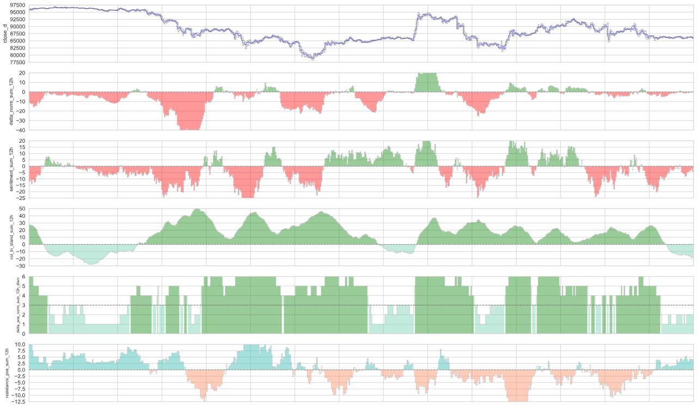
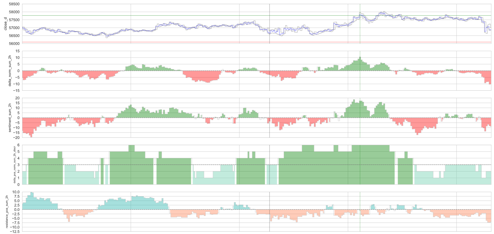

# Trading Indicators Dashboard  

## 📌 Project Overview  

This project provides a **comprehensive visualization framework** for proprietary trading indicators, designed to enhance decision-making in financial markets. The raw market data is sourced from **Binance API** (a separate repository will be available on the author's GitHub for data fetching).  

Since the indicator calculations rely on **proprietary algorithms**, they are **not included** in this repository. Instead, a **precomputed dataset (CSV format)** is used to demonstrate the visualization capabilities.  

The primary objective of this project is to **consolidate multiple trading indicators into a single, structured dashboard**, allowing for a more intuitive and data-driven market analysis. The visualization approach ensures that traders can quickly interpret signals, track price movements, and assess trade opportunities in an efficient and visually compelling manner.  

## 🔧 Workflow  
1. **Fetching Data**:  
   - Original trading data is collected via Binance API (handled in a separate project).  
   - Data includes timestamp, price, volume, market delta and other parameters.  
2. **Indicator Calculation (Proprietary Logic - Not Included)**:  
   - The fetched data is processed with custom-built functions to compute trading indicators.  
   - These functions are **not shared publicly** to protect the author's intellectual property.  
3. **Visualization**:  
   - The CSV file with precomputed indicators is loaded.  
   - A set of custom plotting functions is used to create a **comprehensive trading dashboard**.  
   - The indicators and price movements are visualized in a structured format for **better market insights**.  

## 📊 Visualization Features  

This project includes a set of **custom visualization functions** designed for analyzing trading data. The key features are:

- **Price Action Visualization**  
  - Step-line plots for **closing prices** to represent market trends.  
  - **High and Low price movements** displayed for additional insight.  
  - Configurable for different time intervals (**e.g., 6H, 1D**).  

- **Custom Indicator Charts**  
  - Supports plotting **any numerical indicator** from the dataset.  
  - Auto-scaling of Y-axis using quantiles to improve readability.  
  - **Shaded areas** highlight positive/negative indicator values when applicable.  

- **Trade Entry & Exit Highlights**  
  - **Vertical dashed lines** indicate trade entry and exit points.  
  - Exit reasons are **color-coded**:  
    - **Red** → Stop-loss triggered.  
    - **Green** → Take-profit reached.  
    - **Brown** → Other exit conditions.  

- **Support for Trading Strategy Visualization**  
  - Plots **stop-loss and take-profit levels** on price charts.  
  - Includes **quarterly reference points** (last Friday of the quarter).  

- **Custom X & Y Axis Configuration**  
  - **Date formatting and tick placement** based on data frequency.  
  - Adaptive Y-axis range and tick step-size adjustment.  
  - Adaptive font size for titles

- **Volume & Index Indicators**  
  - **Bar charts** visualize trading volume and premium index changes.  
  - Separate color schemes for **positive and negative movements**.  

These functions provide a **comprehensive market overview**, making it easier to analyze trends and optimize trading strategies.  

### Examples of Indicators Displayed on a Single Canvas  

  

**Including Stop-Loss (SL) and Take-Profit (TP) Levels, along with Entry and Exit Time Points:**  

  

## 📂 Installation & Setup  
1. **Clone the repository**  
   ```
   git clone https://github.com/ilgiz-almv/trading_indicators_dashboard.git
   cd trading_indicators_dashboard
   ```
2. **Install dependencies**  
   ```
   pip install -r requirements.txt
   ```
3. **Run the Jupyter Notebook**  
   ```
   jupyter notebook notebook/visualization.ipynb
   ```

## Data Format  
Since indicator calculations are not included, a **precomputed dataset (CSV file)** is used.  
The expected CSV format includes:  
```
time_UTC, open, high, low, close, volume, number_of_trades, taker_buy_vol, open_d, high_d, ...
```

### **Key Columns:**
- `time_UTC` → Trade timestamp in UTC  
- `open, high, low, close` → Spot market price data  
- `volume` → Trading volume in the given interval  
- `number_of_trades` → Total number of executed trades within the interval  
- `taker_buy_vol` → Volume of buy orders executed at the ask price  
- `open_d, high_d, low_d, close_d` → Futures market price data  

Additional columns include **proprietary trading indicators**, which are used for in-depth market analysis but are not disclosed in this repository.  

## 🛠 Dependencies  
- `pandas`  
- `numpy`  
- `matplotlib`  
- `seaborn`  
- `ipython`  

All dependencies are listed in `requirements.txt`.  

## ⚠️ Disclaimer  
This project is for **educational purposes only**. It does not provide financial advice or guarantee trading success. Always do your own research before making trading decisions.  

## 📌 Technologies Used

- **Programming Language:** Python  
- **Visualization Libraries:** Matplotlib, Seaborn  
- **Data Handling & Processing:** Pandas, NumPy  
- **Jupyter Environment:** IPython, Jupyter Notebook

## Author

- **Ilgiz Almukhametov**  
- **GitHub:** https://github.com/ilgiz-almv
- **LinkedIn:** https://www.linkedin.com/in/ilgiz-almv/

## License
This project is licensed under the **MIT License**.

**GitHub Repository:** https://github.com/ilgiz-almv/trading_indicators_dashboard
